# Foodies
A food recipes app with information about the different dishes and the steps to prepare it. This project is part of a course material that i followed to learn Kotlin, Jetpack Components etc.


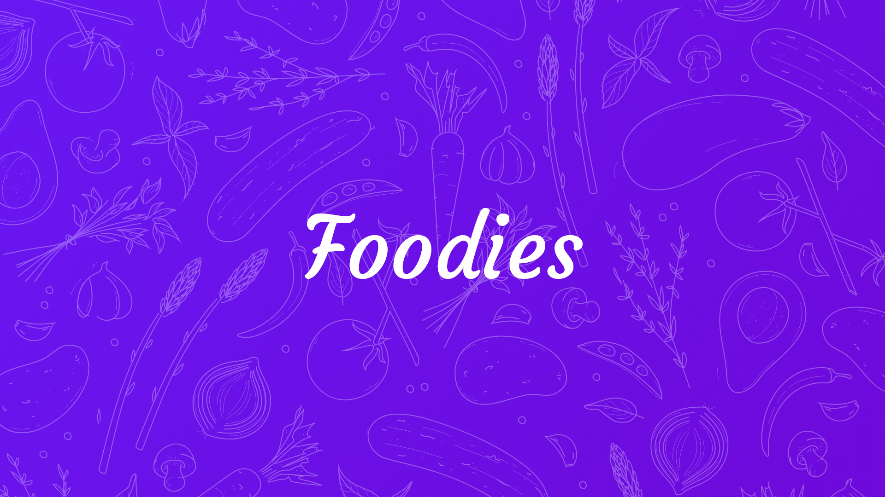

Download
--------
APK can be found [here][1]

Screenshots
-----------

| Screenshot 1  | Screenshot 2  | Screenshot 3 |
| --------------- | --------------- |------------|
| 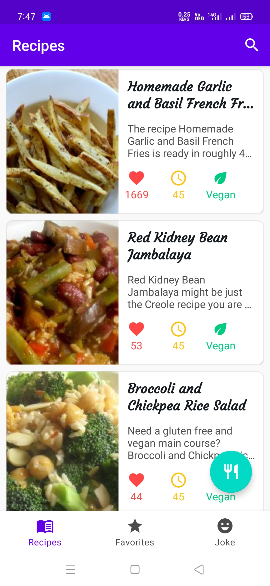 | 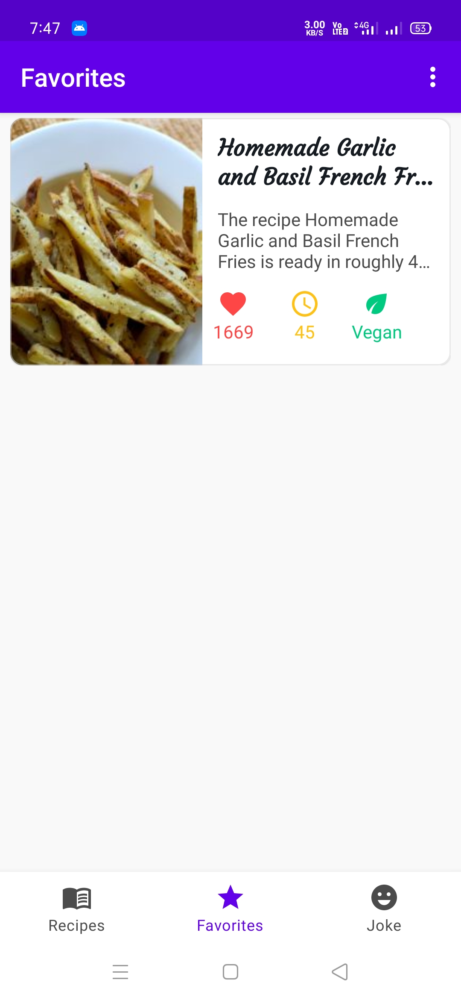 | 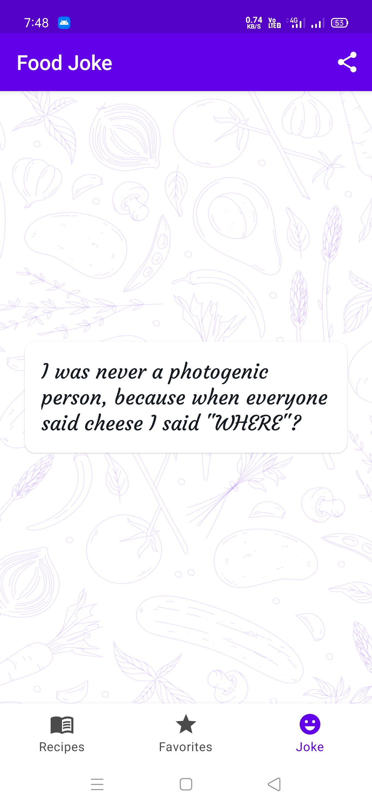 |
| Screenshot 4  | Screenshot 5  | Screenshot 6 |
| 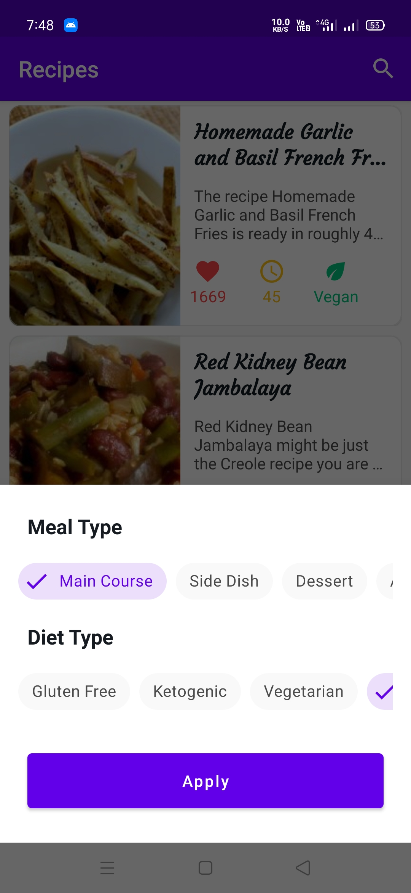 | 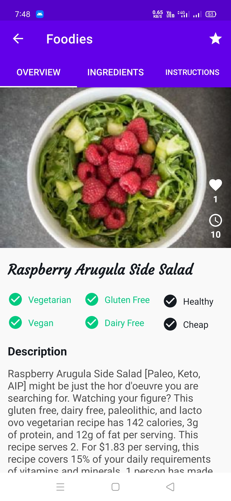 | 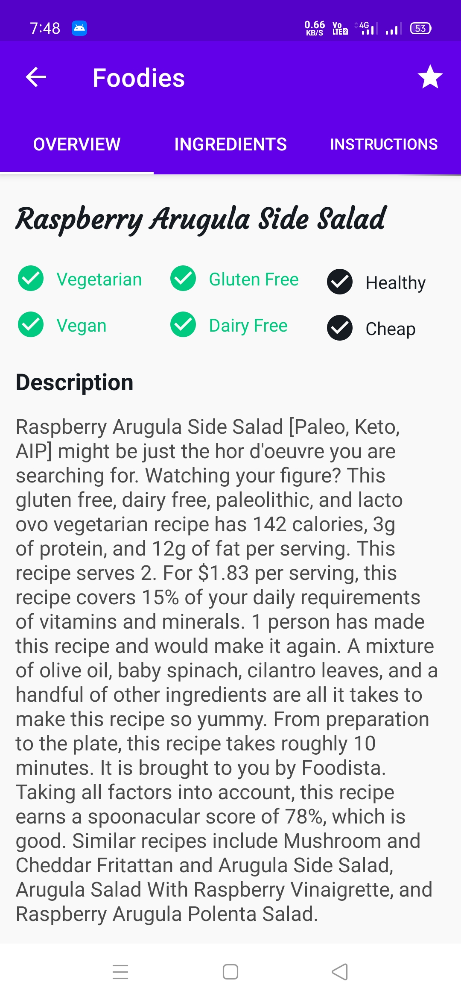 |
| Screenshot 7  | Screenshot 8  | Screenshot 9 |
| 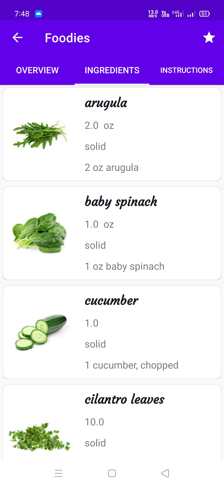 | 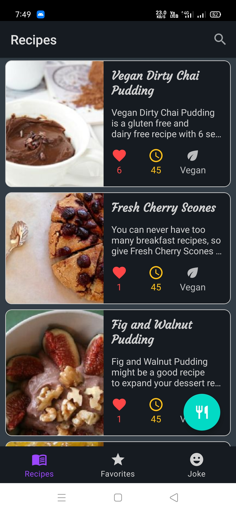 | 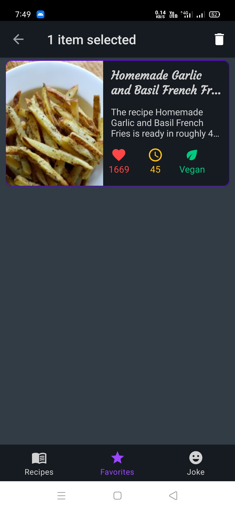 |
| Screenshot 10  | Screenshot 11  | Screenshot 12 |
| 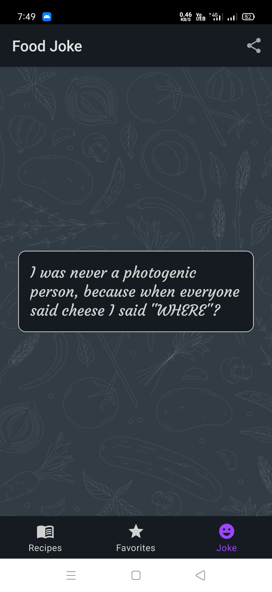 | 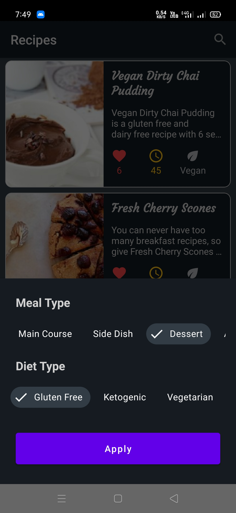 | 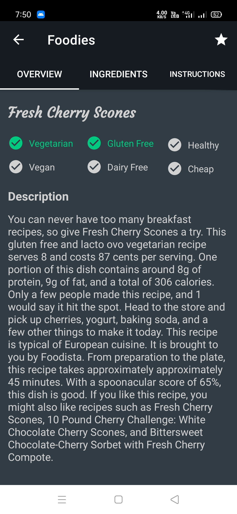 |
| Screenshot 13  |
| 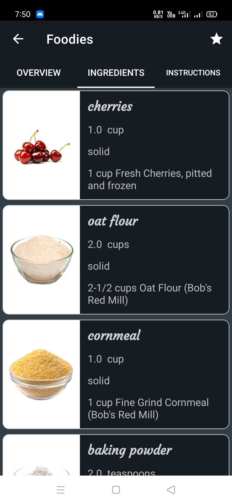 |

Libraries Used
--------------


API Details
-----------

Register here for getting the [api key][2]

Where to paste the API Key?
--------------------------

Go to ` Constants.kt ` file inside ` Utils ` package and find `API_KEY` variable and paste your API key.

```
class Constants {

    companion object {
    
        ...

        const val API_KEY = "YOUR_API_KEY"
        
    }
}   
```

Project Structure
----------------

| Package Name   | What is it used for  |
| :------------ | :------------ |
| adapters | contains all the adapters used in recycler views |
| binding adapters | contains all the binding adapters (used in XML layouts) |
| data | contains the data source (remote, local and datastore preferences)   |
| di | contains all the dependency injection modules |
| ui | contains all the activities, fragments and bottomsheet |
| utils | contains utility files like `Network Listeners`, `Constants`, etc. |
| viewmodels | contains `MainViewModel` and `RecipesViewModel` |

Author
------
<b>Rajit Deb</b>

Find me on
----------
[](https://www.linkedin.com/in/imrajit/)
[](https://www.instagram.com/rajit.deb/)

[1]: https://github.com/rajitdeb/Foodies/raw/master/foodies_final_build.apk
[2]: https://spoonacular.com/food-api/console#Dashboard
